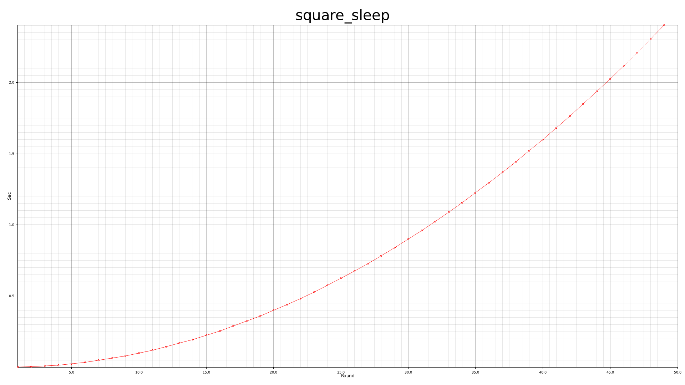

# Rust Crate for Generating Performance Chart

This crate will generate a PNG file for how much time
did your function takes for each iteration.

Example code:

```rust
use perf_plotter::generate_performance_png;

fn main() {
    let data: Vec<u32> = (1..50).collect();

    generate_performance_png(
        test_fun,
        data.into_iter(),
        std::path::Path::new("/tmp/a.png"),
        "square_sleep",
    )
    .unwrap();
}

fn test_fun(time_ms: u32) -> Option<()> {
    std::thread::sleep(std::time::Duration::from_millis(time_ms.pow(2).into()));
    Some(())
}
```



